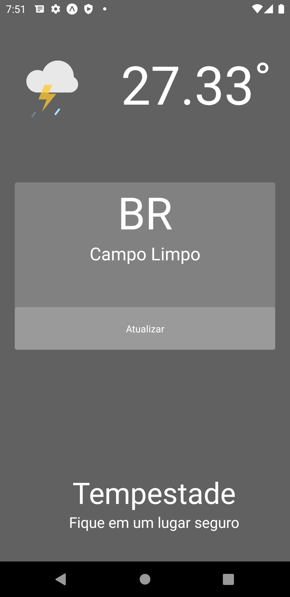
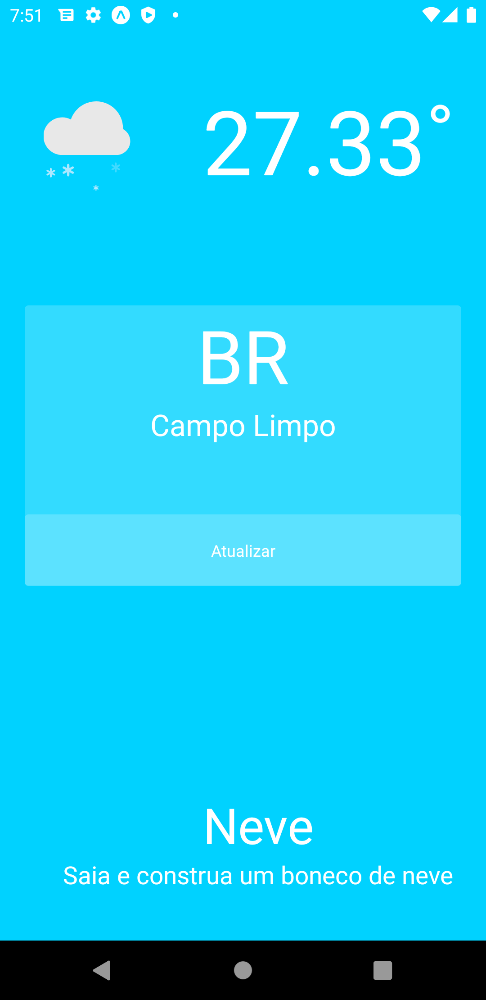
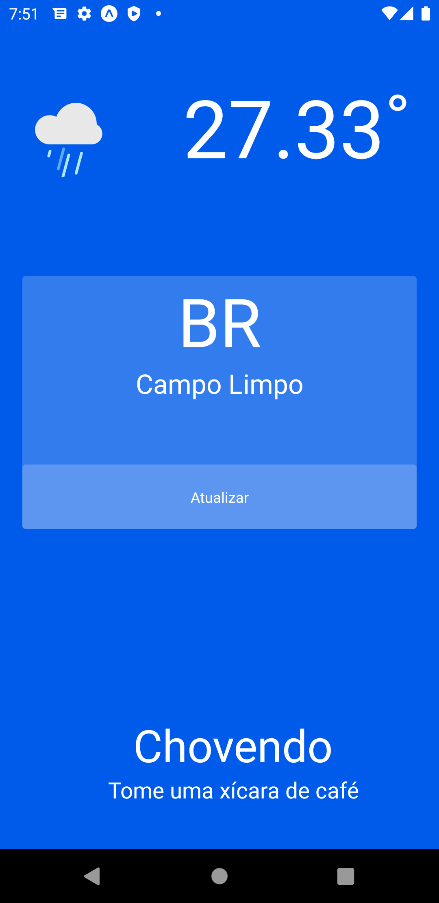
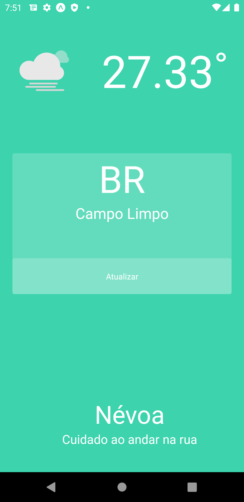
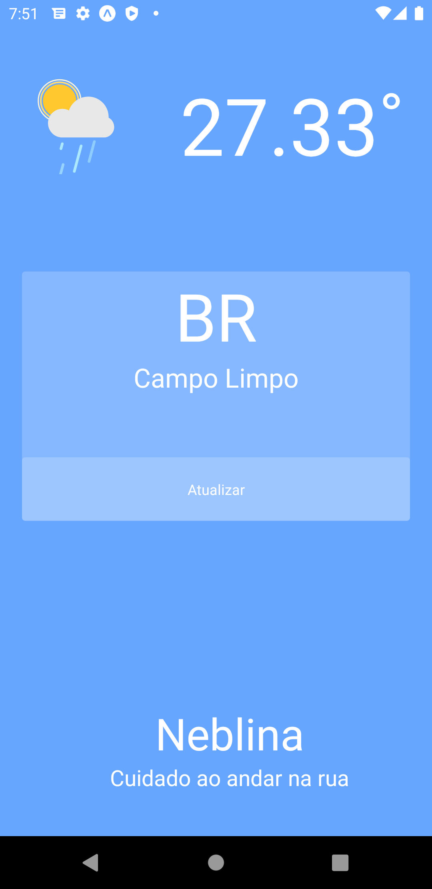
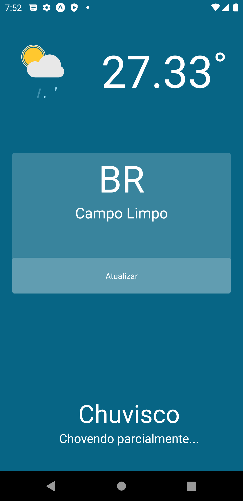
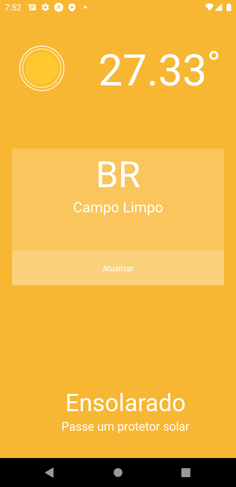

<h1 align="center">Minimalist Weather</h1>

<p align="center">Aplicação que apresentar o clima e tempo com base em sua localização atual, utiliza a api <a href="https://openweathermap.org/api">Open Weather Map</a> </p>

### Features

- [x] Geolalização
- [x] Clima/Tempo
- [x] Animação Lottie

<p align="center"></p>

### Listagem de climas

<table>
          <tr>
             <td>  </td>
             <td>  </td>
          </tr>
          <tr>
             <td>  </td>
             <td>  </td>
          </tr>
          <tr>
             <td>  </td>
             <td>  </td>
          </tr>
          <tr>
            <td>  </td>
            <td>  </td>
          </tr>
</table>

### Pré-requisitos

Antes de começar, você vai precisar ter instalado em sua máquina as seguintes ferramentas:
[Git](https://git-scm.com), [Node.js](https://nodejs.org/en/), [Expo.io](https://expo.io/). Além disto é bom ter um editor para trabalhar com o código como [VSCode](https://code.visualstudio.com/)

### 🎲 Rodando aplicação mobile

```bash
# Clone este repositório
$ git clone <http://github.com/daviddossantos/minimalist-weather>

# Acesse a pasta do projeto no terminal/cmd
$ cd minimalist-weather

# Instale as dependências
$ yarn install

# Execute a aplicação
$ expo start
```

### ⚔ Tecnologias

As seguintes ferramentas foram usadas na construção do projeto:

- [Expo](https://expo.io/)
- [Node.js](https://nodejs.org/en/)
- [React Native](https://reactnative.dev/)
- [JavaScript](https://www.javascript.com/)
- [Lottie](https://lottiefiles.com/)

Feito com 💖 by David Cruz 😀 [Entre em contato!](https://www.linkedin.com/in/daviddossantoscruz/)

## 🗂 Licença

Esse projeto está sob a licença MIT. Veja o arquivo [LICENSE](LICENSE.md) para mais detalhes.

---
